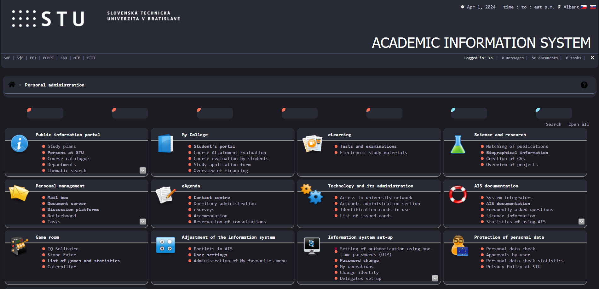
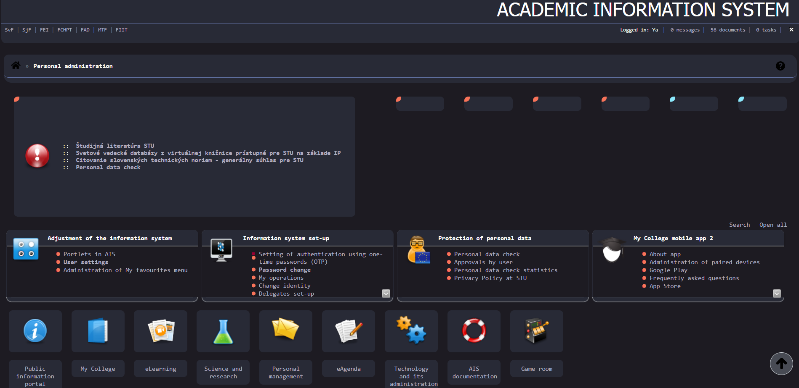
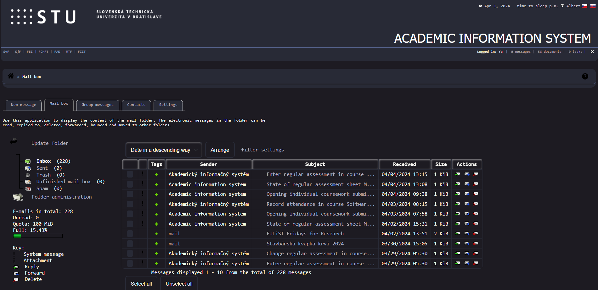
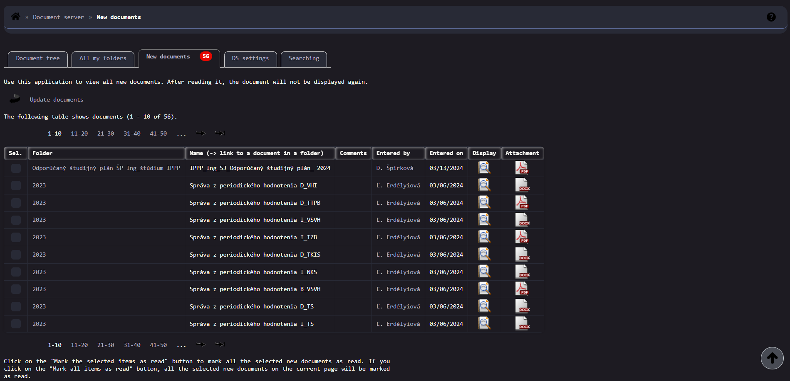

---

## AIS Dark Theme

This repository contains a custom dark theme for the STUBA AIS website, created using Stylus extension for web browsers. The theme provides a sleek and modern look, enhancing the user experience while browsing the STUBA AIS platform.

### Installation

1. **Install Stylus Extension**: First, install the Stylus extension for your web browser. You can find it in the [Chrome Web Store](https://chromewebstore.google.com/detail/stylus/clngdbkpkpeebahjckkjfobafhncgmne?hl=ru) or [Firefox Add-ons](https://addons.mozilla.org/en-US/firefox/addon/styl-us/).

2. **Install Dark Theme**: Once Stylus is installed, click [here](https://userstyles.world/style/15630/svf-stuba-ais-dark-theme) to install the dark theme for STUBA AIS.

3. **Enjoy**: Visit the STUBA AIS website and experience the enhanced dark theme designed for better readability and eye comfort.

 
  
<h2>📸 Screenshots</h2>

  

---
